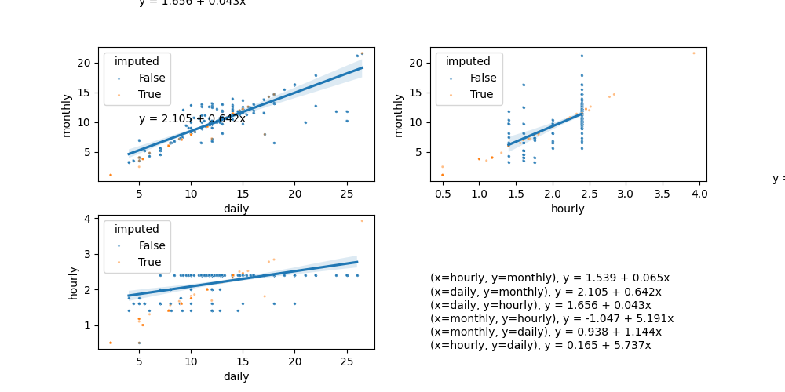
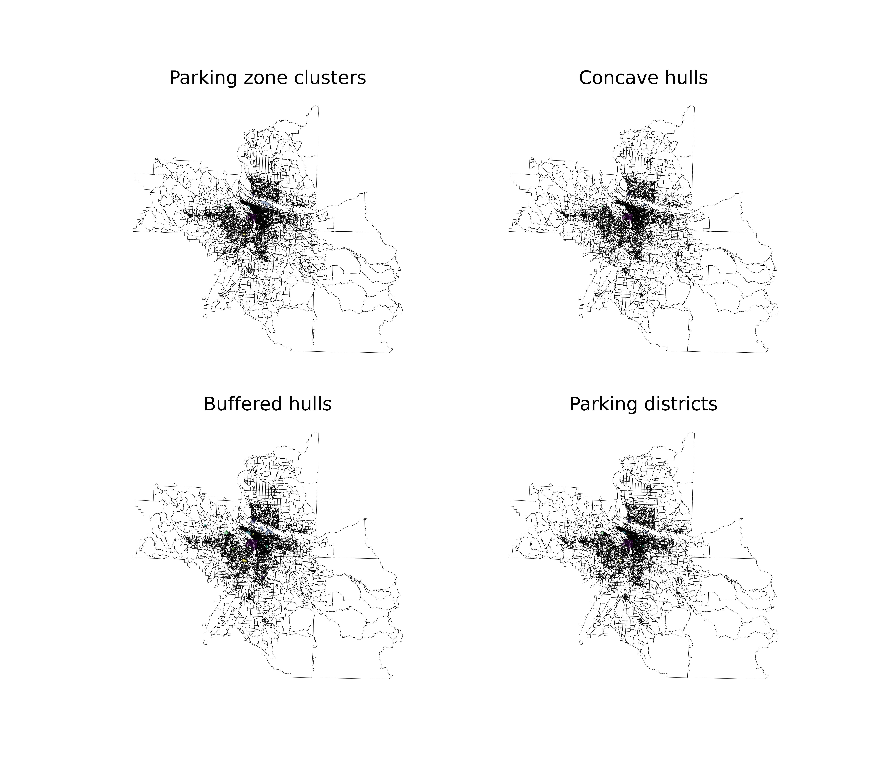
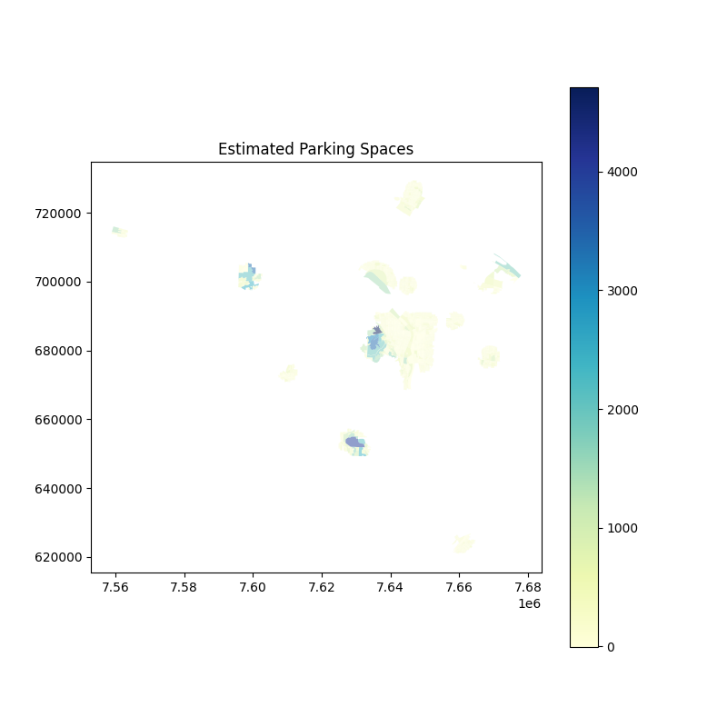
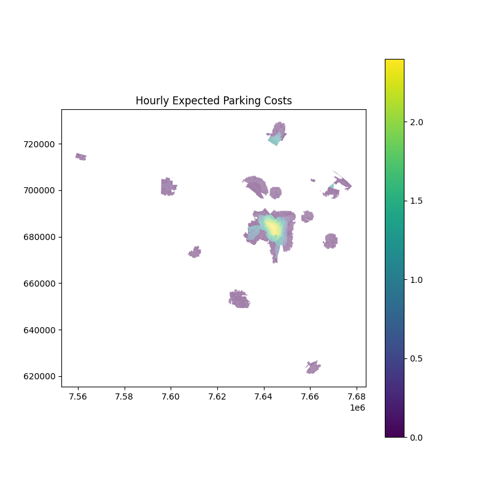
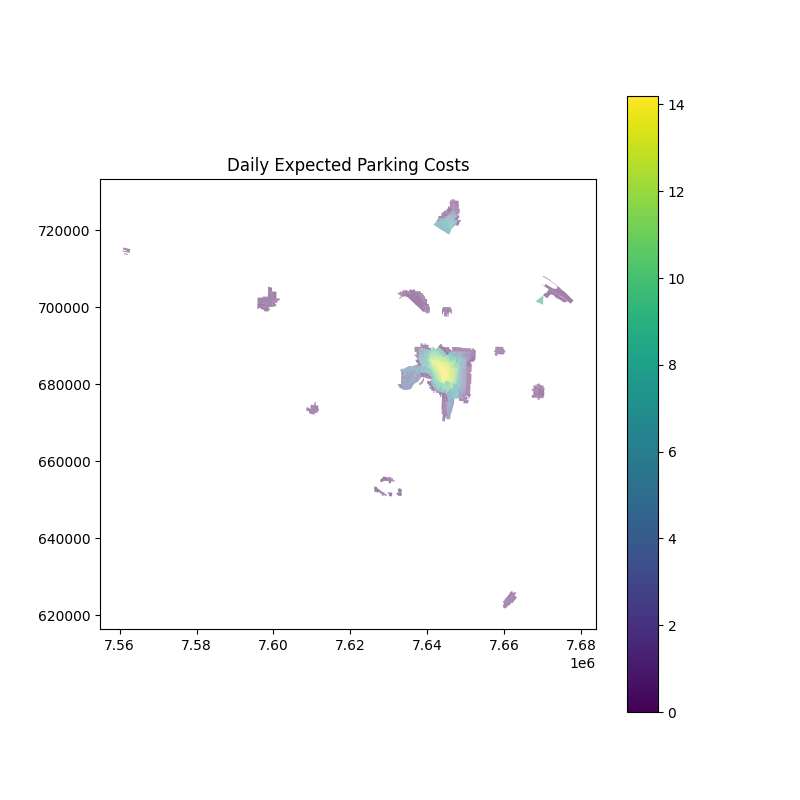

# sandag-parking

This package prepares expected parking cost data for activity-based travel demand models. Originally developed for SANDAG MGRA Series 15 zones, it has been adapted to work with **Metro Portland MAZ** data through a configurable preprocessing pipeline and column mapping.

## Setup

### Requirements
- Python >= 3.10
- [uv](https://docs.astral.sh/uv/) (recommended) or pip

### Installation
```bash
uv sync
```

### Running
```bash
# Via run.py
python run.py

# Or as a module
python -m parking
```

## Configuration

All settings are controlled via `settings.yaml`:

| Setting | Description |
|---|---|
| `inputs.land_use` | Path to the land use CSV |
| `inputs.geometry` | Path to the zone shapefile |
| `inputs.raw_parking_inventory` | *(Optional)* Path to a separate parking inventory CSV (SANDAG-style) |
| `column_mapping` | Renames input columns to internal names (e.g., `PRKCST_HR` → `hourly`) |
| `space_estimation_method` | `'calc'` (formulaic) or `'lm'` (regression) |
| `walk_dist` | Maximum walking distance in miles (default: 0.5) |
| `walk_coef` | Walk distance decay coefficient (default: -0.3) |
| `map_center` | `[lat, lon]` for Folium map centering |
| `map_zoom` | Default zoom level for interactive maps |
| `map_tiles` | Tile provider for Folium maps (e.g., `'cartodbpositron'`) |
| `models` | Ordered list of processing steps to run |

### Column Mapping

The `column_mapping` section in `settings.yaml` translates input CSV column names to the internal names the model expects. For Metro data:

```yaml
column_mapping:
  MAZ_NO: mgra       # Zone identifier
  TAZ_NO: TAZ        # TAZ identifier
  PRKCST_HR: hourly  # On-street hourly parking cost
  PRKCST_DAY: daily  # Structured (off-street) daily cost
  PRKCST_MNTH: monthly  # Structured (off-street) monthly cost
  PRKSPACES: spaces  # Structured (off-street) parking spaces
  EMP_TOTAL: emp_total
```

Only columns that need renaming should be listed. Columns already using internal names are passed through unchanged.

## Processing Pipeline

The processing includes the following steps, organized into separate Python modules. These modules inherit shared functionality from `base.py` and are composed together in `process.py` via multiple inheritance, providing a single entry point. The `models` list in `settings.yaml` controls which steps run and in what order.

### Step 1: Preprocessing (`preprocess.py`)

**Method**: `run_preprocessing`

Extracts parking cost and supply columns from the land use table and prepares them for imputation. This step replaces `run_reduction` when the input already contains aggregated parking costs (e.g., Metro data) rather than a separate detailed parking inventory (SANDAG-style).

**For Metro data**:
- `PRKCST_HR` represents on-street hourly parking cost
- `PRKCST_DAY` / `PRKCST_MNTH` represent structured (off-street) daily/monthly costs
- `PRKSPACES` contains structured parking spaces only — on-street spaces are unknown and estimated later

**Logic**:
1. Extracts `hourly`, `daily`, `monthly`, `spaces` from the column-mapped land use table
2. Replaces zero costs with `NaN` (zero means "no data", not "free parking")
3. Sets `spaces = NaN` where structured spaces are 0 or missing, signaling "unknown supply" to the space estimation step
4. Tags zones as having `paid_spaces > 0` if **any** cost is non-zero (even if structured spaces are unknown), ensuring they are included in district creation
5. Drops parking columns from `lu_df` to avoid duplication in downstream joins

### Step 1 (alt): Reduction (`reduction.py`)

> **Note**: This step is **not used** for Oregon Metro. Metro's land use file already contains aggregated parking costs and spaces, so `run_preprocessing` (above) is used instead. This step is retained for backward compatibility with the original SANDAG workflow.

**Method**: `run_reduction`

Used when a **separate raw parking inventory** is provided (SANDAG-style) with detailed on-street/off-street breakdowns. Collapses segments into summary fields:

- `free_spaces = on_street_free + off_street_free + residential`
- `paid_spaces = on_street_paid + off_street_paid_private`
- `hourly` / `daily` / `monthly` = weighted average across on-street and off-street, public and private, selecting max of business/after-business hours

### Step 2: Imputation (`imputation.py`)

**Method**: `run_imputation`

Fills in missing `hourly`, `daily`, and `monthly` costs using **Multiple Imputation by Chained Equations (MICE)** via `sklearn.impute.IterativeImputer`.

**Logic**:
1. Extracts only the three cost columns from reduced parking data
2. Runs MICE (`max_iter=100`, `min_value=0`) — each missing cost is iteratively predicted from the other two using ridge regression
3. Labels which costs were imputed vs. observed
4. Generates diagnostic regression plots



### Step 3: District Creation (`districts.py`)

**Method**: `create_districts`

Groups zones into parking districts using spatial clustering. Three-step process:

#### 3a. Agglomerative Clustering
Zones with `paid_spaces > 0` are spatially clustered using agglomerative clustering:
- **Affinity matrix**: Pre-computed polygon edge-to-edge distances (not centroids)
- **Distance threshold**: `walk_dist` (0.5 miles)
- **Linkage**: `"single"` — chained distance, breaks when threshold is exceeded

#### 3b. Concave Hull
For each cluster, a concave hull (alpha shape) is computed using Delaunay triangulation with α = 1 / (walk_dist × 5280). A buffer of `walk_dist × 5280` feet is added to include walkable surrounding zones.


<br>


#### 3c. Spatial Join
All zones within the buffered concave hulls are spatially joined, forming discrete parking districts. Zones are classified as:
- **Type 1**: Within a cluster AND district (paid parking zone)
- **Type 2**: Within a district buffer only (free parking, used in cost averaging)
- **Type 3**: Outside all districts (no parking cost)



### Step 4: Space Estimation (`estimate_spaces.py`)

**Method**: `run_space_estimation`

Estimates on-street parking spaces per zone using the OpenStreetMap road network.

**Logic**:
1. **Fetch OSM network**: Downloads the drive network for the study area (cached as `./cache/network.graphml`)
2. **Filter streets**: Keeps only parking-eligible types: `residential`, `living_street`, `road`, `tertiary`, `secondary`
3. **Aggregate per zone**: Clips network to each zone polygon, computes total road `length` and `intcount` (intersections)
4. **Estimate spaces**: Two methods controlled by `space_estimation_method`:

   **Formulaic (`'calc'`)** — currently used for Metro:

   spaces = 2 × (L / 10 − N)

   Where L = total street length (feet), N = intersection count. Assumes parking on both sides, one space per 10 feet, minus gaps at intersections.

   **Regression (`'lm'`)**:

   spaces ~ 0 + length + intcount + acres + hh_sf + hh_mf + emp_total

   Trained on zones with known space counts. Requires `hh_sf` and `hh_mf` columns in land use data.

Zones with known `spaces > 0` from the input keep their reported values; the formula only fills unknowns.

5. Generates an interactive Folium choropleth (`estimated_parking_spaces.html`) and a static PNG of the estimated spaces per zone.



### Step 5: Expected Parking Cost (`expected_cost.py`)

**Method**: `run_expected_parking_cost`

Computes the **expected parking cost** for every zone by blending paid and free parking weighted by supply and walking distance.

**Logic**:
1. Merges imputed costs with estimated spaces. Uses reported `spaces` where available, `estimated_spaces` otherwise.
2. Pre-computes a zone-to-zone distance matrix for all zones within parking districts (cached to `./output/distances.csv`)
3. For each destination zone within a district, computes expected cost across all zones within walking distance:

   expected_cost = Σ(exp(d_i × β_walk) × S_i × C_i) / Σ(exp(d_i × β_walk) × S_i)

   Where:
   - d_i = distance from destination to zone i (miles)
   - β_walk = walk coefficient (`walk_coef`, default: -0.3)
   - S_i = parking spaces in zone i
   - C_i = parking cost in zone i (0 for free zones)

   This produces a gravity-weighted average where closer zones and zones with more supply have greater influence. Zones in the buffer region are set to 0 cost. Zones outside all districts default to 0.

4. Generates interactive Folium maps and static PNGs of expected hourly, daily, and monthly costs.





## Output

The final output is written to `./output/final_parking_data.csv`. The `output_columns` section in `settings.yaml` controls which columns are included and how they are renamed:

```yaml
output_columns:
  expected_parking_df:
    exp_hourly:
    exp_daily:
    exp_monthly:
    parking_type:
    spaces_for_calculation: parking_spaces
    estimated_spaces:
    spaces:
```

## Project Structure

```
├── settings.yaml          # Configuration file
├── run.py                 # Entry point script
├── pyproject.toml         # Package metadata and dependencies
├── parking/
│   ├── __init__.py        # Shapely 2.x compatibility shim
│   ├── __main__.py        # Module entry point
│   ├── base.py            # Shared state, I/O, settings loading
│   ├── process.py         # Composes all steps via multiple inheritance
│   ├── preprocess.py      # Step 1: Extract parking data from land use (Metro)
│   ├── reduction.py       # Step 1 alt: Reduce raw parking inventory (SANDAG)
│   ├── imputation.py      # Step 2: MICE imputation of missing costs
│   ├── districts.py       # Step 3: Spatial clustering into parking districts
│   ├── estimate_spaces.py # Step 4: OSM-based space estimation
│   └── expected_cost.py   # Step 5: Expected parking cost calculation
├── data/                  # Input data files
├── output/                # Generated outputs and plots
├── cache/                 # Cached network data and shapefiles
└── notebooks/             # Exploratory analysis notebooks
```
